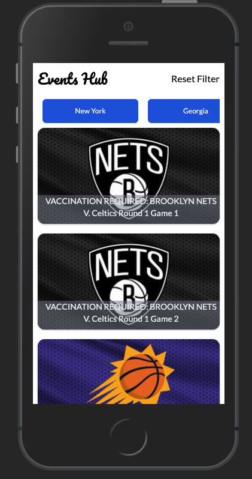
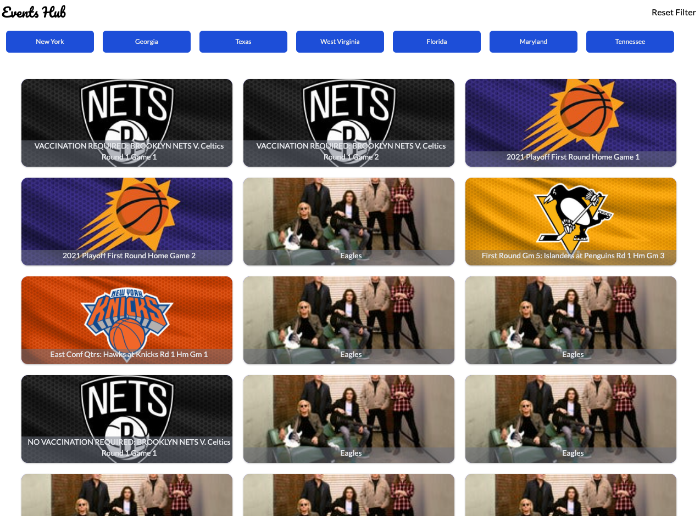

# Events Hub
***A powerful single-page web application for suggesting events. user can filter to show events he/she is most interested in***

 


## Getting Started

To get this project up and running in your local machine, follow these simple example steps.


## Prerequisites 

- Nodejs: >= 15.13.0

Clone repo into your local machine by running 
- `` git clone https://github.com/juxsalley/Events-Hub.git `` ***in your terminal***

open project director in your terminal by  `` cd book-store ``

### install require dependecies 

``` npm install ```

### Run project 

`` npm run start ``

open ```localhost:3000``` in browser. 

### Run Test 

`` npm run test ``


## Live Demo

[Live](https://60a938798eed109a78d5524d--zealous-mayer-d0b63a.netlify.app/)


## **Author**

### Iddrisu Salley | Codesalley

- [\_\_salley | Twitter](https://twitter.com/__salley)
- [Iddrisu salley | LinkedIn](https://www.linkedin.com/in/dev-salley/)

## 🤝 Contributing

Contributions, issues and feature requests are welcome!

Feel free to check the [issues page](https://github.com/juxsalley/Events-Hub/issues).

## Show your support

Give a ⭐️ if you like this project!